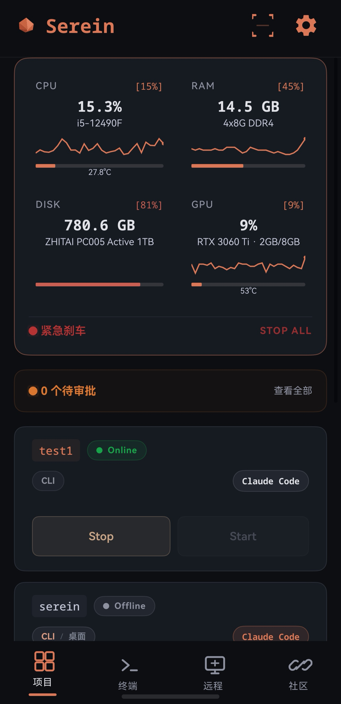
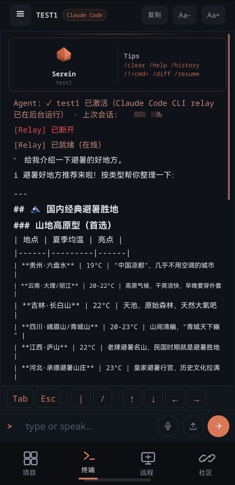
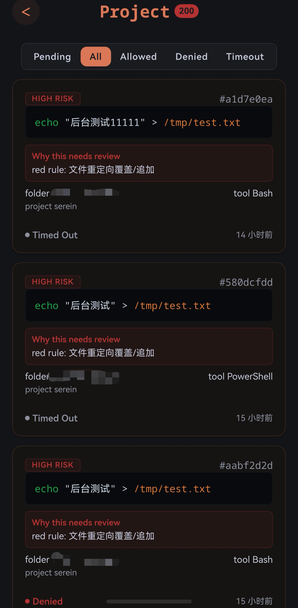
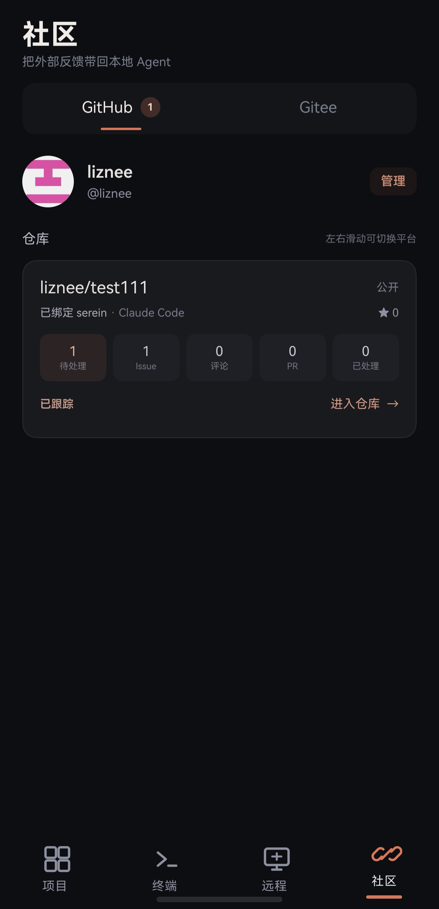
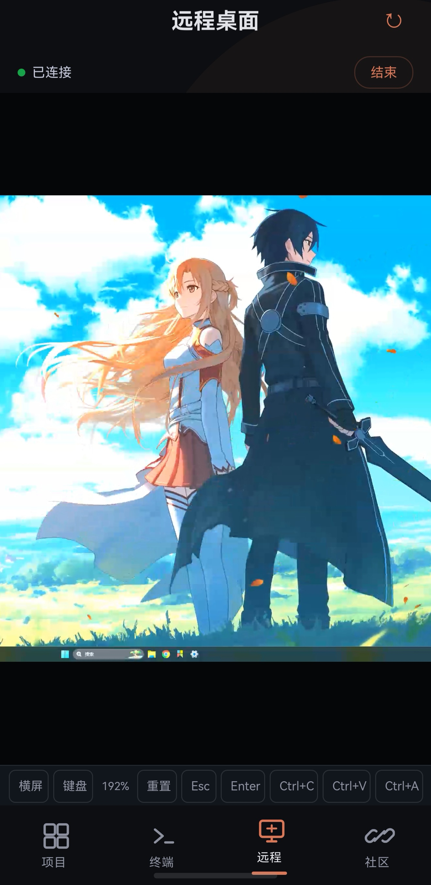

# Serein

> 🌐 官网：**[https://www.serein.run](https://www.serein.run)**

> 面向 HarmonyOS 的 Claude Code / Codex 自托管移动工作台：在手机上继续本地 CLI 会话，并为 Claude Code 提供远程风险审批。

**当前状态：源码公开（非商用许可）V1.0 Release Candidate。** 候选版已通过自动化测试、公开导出、依赖审计和独立构建；Push Kit 正式身份与同一台真机 100 次端到端回归仍是 GA 门禁。RC 可以体验和审计，不建议直接连接拥有生产权限的主机。

Serein 由个人维护并大量使用 AI 协助开发。它不隶属于 Anthropic、OpenAI 或华为，也不提供这些平台的账号、额度或模型服务。

## 产品预览

<p align="center">
  
  
  
  
  
</p>

<p align="center"><sub>项目管理 · 终端会话 · 风险审批 · 社区协作 · 远程桌面</sub></p>

## 它解决什么问题

- 在 HarmonyOS 原生 App 中查看并继续电脑上的 Claude Code / Codex CLI 会话；
- Claude Code 准备执行高风险工具操作时，把允许或拒绝交回手机；
- 用自己的 Go 后端、SQLite、WebSocket 和通知通道保存控制权；
- 把项目启停、终端输出、基础设备监控和单设备配对放在一处。

Serein 不替代官方远程功能。Claude 官方 Remote Control 支持 Claude App 和任意浏览器，但要求 claude.ai 订阅登录，不支持 API Key 或第三方模型提供商；Codex Remote 通过 ChatGPT 手机 App 配对 ChatGPT 桌面端。Serein 更适合需要 **HarmonyOS 原生、自托管、Claude/Codex CLI 统一入口或自定义 Agent 接入环境** 的用户。

- [Claude Code Remote Control（官方）](https://code.claude.com/docs/en/remote-control)
- [Codex Remote（官方）](https://learn.chatgpt.com/docs/remote)

## 开放范围与成熟度

V1.0 采用单一开放源码版本。仓库中已经实现的产品功能全部保留，公开导出只清理私人配置、签名、日志、缓存和构建产物，不会关闭页面或替换功能实现。

**稳定核心：**

- 项目注册、启停和单设备配对；
- Claude Code / Codex CLI 的 PTY 会话与手机实时终端；
- Claude Code `PreToolUse` 风险分级、远程审批和审批历史；
- 在线通知、可选 HarmonyOS Push Kit、基础设备监控；
- 自托管后端、Token 隔离、超时拒绝和本地安全存储。

**实验功能（同样开放源码，但不承诺与稳定核心相同的兼容性）：**

- 远程桌面与触控；
- GitHub/Gitee 社区工作流；
- Codex Desktop 会话发现与接管。

实验功能与稳定核心使用相同的开放源码许可，但仍保留实验标识、权限确认和安全限制。未来如提供商业服务，将聚焦托管 Relay/TURN/OAuth、团队策略、可用性保障和技术支持；自托管源码不会设置本地功能墙。完整原则见 [V1.0 产品边界](docs/V1_0_PRODUCT_BOUNDARY.md)。

## 安全模型

```text
Claude Code 工具调用
  -> Python PreToolUse Hook 本地分级
  -> 绿/黄规则按配置处理
  -> 红色请求提交自托管 Go 后端
  -> 手机收到审批卡片
  -> 用户允许或拒绝
  -> Hook 把决定返回 Claude Code
```

- Hook 使用 `SEREIN_HOOK_TOKEN`，手机使用配对后签发的设备 Token；
- 后端不可用、审批超时或响应异常时默认拒绝，不静默放行；
- App 只允许一个已绑定主设备，Token 存入 HarmonyOS HUKS；
- 外部 Issue、评论和附件按不可信数据处理，高风险操作仍需审批；
- 真实密钥只进入环境变量或本地安全存储

完整威胁模型和漏洞报告方式见 [SECURITY.md](SECURITY.md)。

## 架构

```text
HarmonyOS App (ArkTS)
        | HTTPS / WSS
Go Backend + SQLite ---- ntfy / optional Push Kit
        | WSS
PC Relay (Node.js + node-pty)
        | PTY / JSONL
Claude Code CLI or Codex CLI

Claude Code PreToolUse -> Python Hook -> Go Backend -> phone approval
```

技术栈：Go + chi + SQLite、Node.js + node-pty、Python 标准库、HarmonyOS ArkTS。

## 快速开始

### 0. Windows 一行安装（最快路径）

PowerShell 中执行（自动检查 Node/Python、下载 Agent、安装依赖、创建 `serein` 命令）：

```powershell
irm https://www.serein.run/install.ps1 | iex
```

> 该脚本下载 PC 端 Agent 并创建全局 `serein` 命令；后端和 HarmonyOS App 仍需按下文 2、5 步配置。完整参数见 `install.ps1` 头部说明。

### 1. 准备环境

- 一台可运行 Docker Compose 的 Linux 服务器；本机体验也可直接运行 Go 后端；
- PC 上的 Node.js 18+、Python 3.10+，以及可从终端执行的 `claude` 或 `codex`；
- HarmonyOS 设备。自行构建 App 时还需要 DevEco Studio 和对应 SDK。

### 2. 启动自托管后端

```bash
cd deploy
cp backend.env.example .env
../scripts/gen-tokens.sh
# 把命令输出的 HOOK_TOKEN 和 PAIR_CODE 写入 .env
docker compose up -d --build
curl http://127.0.0.1:8080/healthz
```

公网使用必须在后端前配置 HTTPS/WSS。域名、反向代理、Push Kit、更新和故障排查见 [部署指南](docs/DEPLOYMENT.md)。

### 3. 从源码安装 PC CLI

在已克隆的仓库根目录执行：

```bash
npm ci
npm install -g .
```

然后在当前 shell 配置与服务器一致的值：

```bash
export SEREIN_BACKEND=https://your-serein.example.com
export SEREIN_HOOK_TOKEN=replace-with-the-same-hook-token
export SEREIN_PAIR_CODE=replace-with-the-same-pair-code
```

PowerShell 使用：

```powershell
$env:SEREIN_BACKEND = 'https://your-serein.example.com'
$env:SEREIN_HOOK_TOKEN = 'replace-with-the-same-hook-token'
$env:SEREIN_PAIR_CODE = 'replace-with-the-same-pair-code'
```

初始化和检查：

```bash
serein init
serein doctor
```

`serein init` 才会写入 Claude Code Hook 配置；安装包本身不会自动修改 `~/.claude/settings.json`。已有后端地址和 Token 不会被初始化命令覆盖。

### 4. 注册项目并配对

```bash
cd /path/to/your/project
serein pair
```

在手机 App 中扫描二维码。配对后可按项目选择 Claude Code 或 Codex，再启动终端会话。

## CLI

| 命令 | 用途 |
|---|---|
| `serein` / `serein start` | 启动当前项目的远程终端 |
| `serein init` / `serein setup` | 初始化 Claude Code Hook 与本地配置 |
| `serein doctor` | 只读检查运行环境、配置和后端健康状态 |
| `serein pair` | 显示当前项目的配对二维码 |
| `serein daemon` | 运行后台 Relay，等待手机发起启动 |
| `serein --agent claude\|codex` | 指定本次会话的 Agent |

Claude Code 具备结构化会话和工具审批能力。Codex 已适配回复、思考、工具调用和结果事件，但 Codex 工具审批仍未达到 Claude Code 的完整兼容级别。Gemini 等未声明支持的 Agent 会在启动前被拒绝。

## 客户端构建

```powershell
cd harmony
powershell -ExecutionPolicy Bypass -File build2.ps1
```

产物位于：

```text
harmony/entry/build/default/outputs/default/entry-default-signed.hap
```

DevEco 已完成签名时可直接安装该 HAP。不要再用其他脚本覆盖签名，否则设备可能拒绝 PKCS#7 校验。

## 测试

```bash
# 根目录 CLI 与公开包检查
npm test
npm run release:check

# Go 后端
cd backend && go test ./... && go vet ./...

# Python Hook / Agent
cd hooks && python -m unittest test_risk_classify && python test_approval_hook.py
cd ../agent && python -m pytest -q && npm test
```

发布门禁和当前证据见 [V1.0 发布门禁](docs/V1_0_RELEASE_GATE.md) 与 [稳定性结果](docs/V1_0_STABILITY_RESULTS.md)。

## 项目结构

```text
backend/   Go 后端、SQLite、HTTP/WebSocket API
agent/     PC Relay、PTY、Claude/Codex 会话解析
hooks/     Claude Code PreToolUse 风险分级与审批 Hook
harmony/   HarmonyOS 原生 ArkTS App
deploy/    Docker Compose、ntfy 与反向代理示例
ui/        官网宣传页
docs/      产品边界、安全、部署和发布文档
scripts/   安装、检查、测试和发布辅助脚本
```

## 文档

- [部署指南](docs/DEPLOYMENT.md)
- [安全策略](SECURITY.md)
- [贡献指南](CONTRIBUTING.md)
- [产品边界](docs/V1_0_PRODUCT_BOUNDARY.md)
- [Push Kit 配置](docs/PUSH_KIT_SETUP.md)
- [官网维护说明](docs/WEBSITE_IMPLEMENTATION.md)

## 更新

**PC 端（Agent / Relay）**：重新执行一行安装命令即可。脚本会从 GitHub `main` 分支拉取最新文件，并自动对比版本：

```powershell
irm https://www.serein.run/install.ps1 | iex
```

- 已安装过会提示"目录已存在"，输入 `y` 覆盖更新；
- 需要免确认更新时，本地执行：`powershell -ExecutionPolicy Bypass -File install.ps1 -Update`；
- 当前安装版本记录在 `~/.serein/.installed-version`，每次运行会显示"已是最新版本 / 已更新到 vX.Y.Z"。

**HarmonyOS App**：开源版没有应用商店 OTA，需要自己用 DevEco Studio 编译最新源码并侧载安装（调试签名有效期 14 天，更换签名后需在手机端重新扫码配对一次）。

**关注新版本**：在 GitHub 仓库点 **Star** 并 **Watch → Releases**，发布新版本时会收到通知。

## 联系

- 官网：<https://www.serein.run>
- 邮箱：<contact@serein.run>（产品反馈、合作或其他事项）

## 已知限制

- 当前公开候选版只提供 HarmonyOS 客户端；
- App 被系统彻底回收后的可靠通知依赖正确开通的 Push Kit 正式身份；
- Codex 的工具审批兼容度低于 Claude Code；
- 后端是自托管组件，部署者负责 TLS、密钥轮换、备份和更新；
- 开源 V1.0 尚未完成同一台真机 100 次关键链路回归，因此仍标记 RC。

## License

[PolyForm Noncommercial 1.0.0](LICENSE) — 源码公开，允许**个人 / 学习 / 研究 / 非商业自用**；商业使用、商业分发、SaaS 或集成到商业产品需另行取得书面授权（contact@serein.run）。
